# 系统设计文档

> 状态: 已实现
> 最后更新: 2026-03-09

## 实现状态速查

| 模块 | 实现文件 | 状态 |
|---|---|---|
| 配置加载 + 校验 | `internal/config/config.go` | ✅ |
| 数据库（SQLite WAL）| `internal/db/db.go` | ✅ |
| 数据模型 | `internal/model/models.go` | ✅ |
| Claude CLI 执行器 | `internal/claude/executor.go` | ✅ |
| 飞书 WS 接收 + 附件下载 | `internal/feishu/receiver.go` | ✅ |
| 飞书消息/卡片发送 | `internal/feishu/sender.go` | ✅ |
| Session Manager | `internal/session/manager.go` | ✅ |
| Session Worker | `internal/session/worker.go` | ✅ |
| Task Watcher（fsnotify）| `internal/task/watcher.go` | ✅ |
| Task Scheduler（gocron）| `internal/task/scheduler.go` | ✅ |
| Task Runner | `internal/task/runner.go` | ✅ |
| 附件定期清理 | `internal/task/cleanup.go` | ✅ |
| Workspace 初始化 | `internal/workspace/init.go` | ✅ |
| Workspace 模板 | `workspaces/_template/` | ✅ |
| 主入口 | `cmd/server/main.go` | ✅ |
| 测试覆盖 | config / claude / workspace / task / session | ✅ 部分覆盖 |

---

## 一、系统概览

企业内部飞书 AI 助理平台。每个业务场景对应一个飞书应用 + 一个 Claude Code workspace 目录，用户在飞书中发消息，框架路由到对应 workspace 执行 `claude` CLI，将结果返回给用户。

**部署约束**：单机 · SQLite · 子进程 claude · 应用间逻辑隔离（不同 workspace 目录）· 单机 cron

---

## 二、整体架构

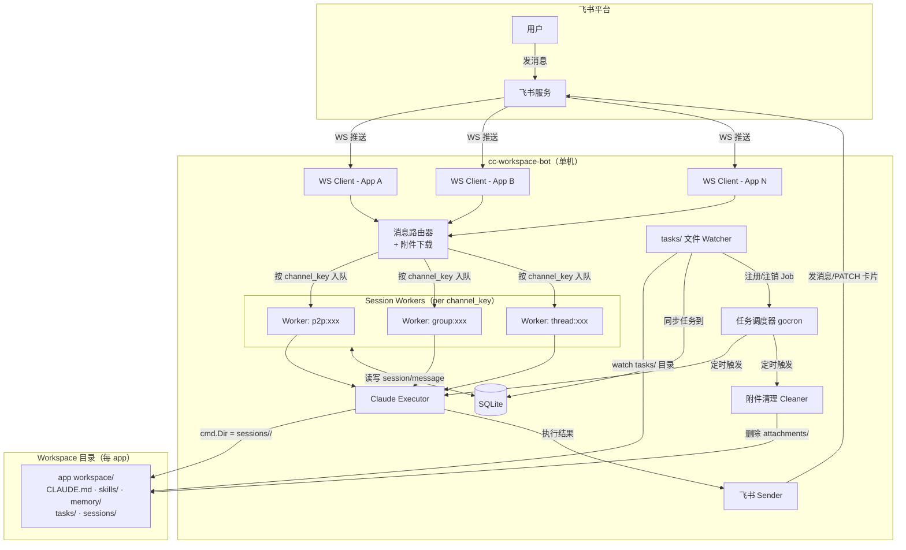

---

## 三、核心概念

### Channel 与 Session 的关系

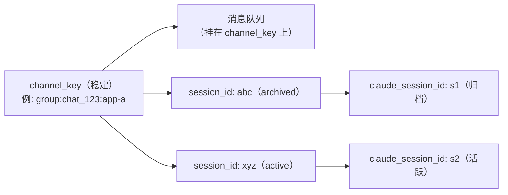

- **channel_key**：飞书渠道的稳定标识，对应一个常驻 Worker goroutine 和消息队列
- **session_id**：当前活跃会话，`/new` 时归档旧 session、生成新 session_id
- **claude_session_id**：claude CLI 的 `--resume` 参数，新 session 时为空（让 claude 创建全新 context）

### Channel Key 生成规则

> **注意**：P2P channel_key 使用飞书的 `chat_id`（会话 ID），不是用户的 `open_id`。

| 飞书渠道 | ChatType | channel_key 格式 | 支持 /new |
|---|---|---|---|
| 单聊（P2P）| `p2p` | `p2p:{chat_id}:{app_id}` | ✅ |
| 普通群聊 | `group` | `group:{chat_id}:{app_id}` | ✅ |
| 话题群 | `topic_group` / `topic` | `thread:{chat_id}:{thread_id}:{app_id}` | ❌ |

### channel_key → routing_key 转换

feishu_ops Python 脚本使用的 `routing_key` 格式与内部 `channel_key` 不同，executor 在调用前通过 `channelKeyToRoutingKey()` 转换：

| 内部 channel_key | feishu_ops routing_key | 说明 |
|---|---|---|
| `p2p:{chat_id}:{app_id}` | `p2p:{chat_id}` | 去掉 app_id |
| `group:{chat_id}:{app_id}` | `group:{chat_id}` | 去掉 app_id |
| `thread:{chat_id}:{thread_id}:{app_id}` | `group:{chat_id}` | 话题群以主群 chat_id 发送 |

### Worker 生命周期

- 第一条消息到达时懒启动
- 空闲超过 **30 分钟**（可配置）自动退出，下次消息到达时重建
- Session 空闲超时（Worker 退出时）触发 session 归档，`claude_session_id` 保留不清除（下次可恢复）

---

## 四、数据模型（ER 图）

> TASKS 表由 tasks/ 文件 Watcher 写入，是 YAML 文件的运行时镜像。YAML 文件为 source of truth，DB 记录运行时状态（`last_run_at`、`enabled`）。

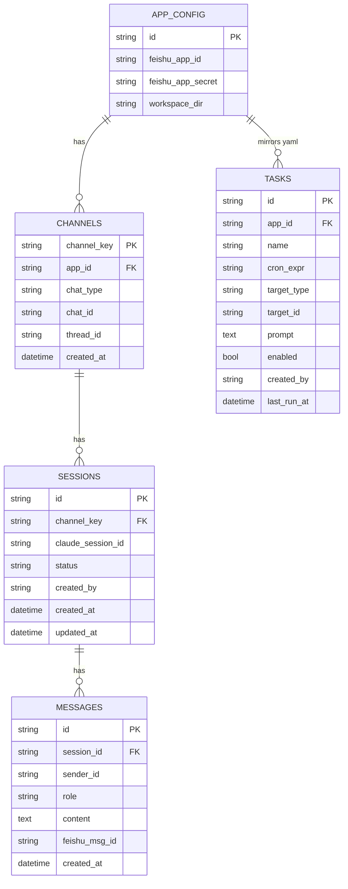

---

## 五、消息处理时序

### 5.1 文件/图片预处理

飞书消息中的文件和图片在传给 claude 前需先下载到本地。下载分两步：
1. **receiver**：调用飞书 API，保存到系统临时目录（`os.TempDir()`）
2. **worker**：`moveAttachments()` 将临时文件移入 `sessions/<session-id>/attachments/`，并替换 prompt 中的路径

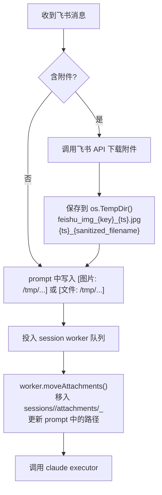

附件 prompt 格式：
- 图片：`[图片: /absolute/path/to/file.jpg]`
- 文件：`[文件: /absolute/path/to/file.pdf]`

---

### 5.2 Context 策略

Claude CLI 通过 `--resume <claude_session_id>` 加载历史 context，由 claude 自身管理 session 文件（存储于 `~/.claude/projects/`）。框架只需持久化 `claude_session_id`：

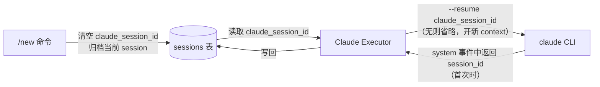

- **历史查询**：claude 通过 `--resume` 已有全量历史，如 context 过长可在 CLAUDE.md 中指导 claude 只关注最近对话
- **`/new`**：清空 `claude_session_id`，下次执行不带 `--resume`，claude 自动开全新 context

---

### 5.3 群聊触发策略

群聊中所有消息均投入队列，由 claude + workspace 的 CLAUDE.md 决定是否回复：

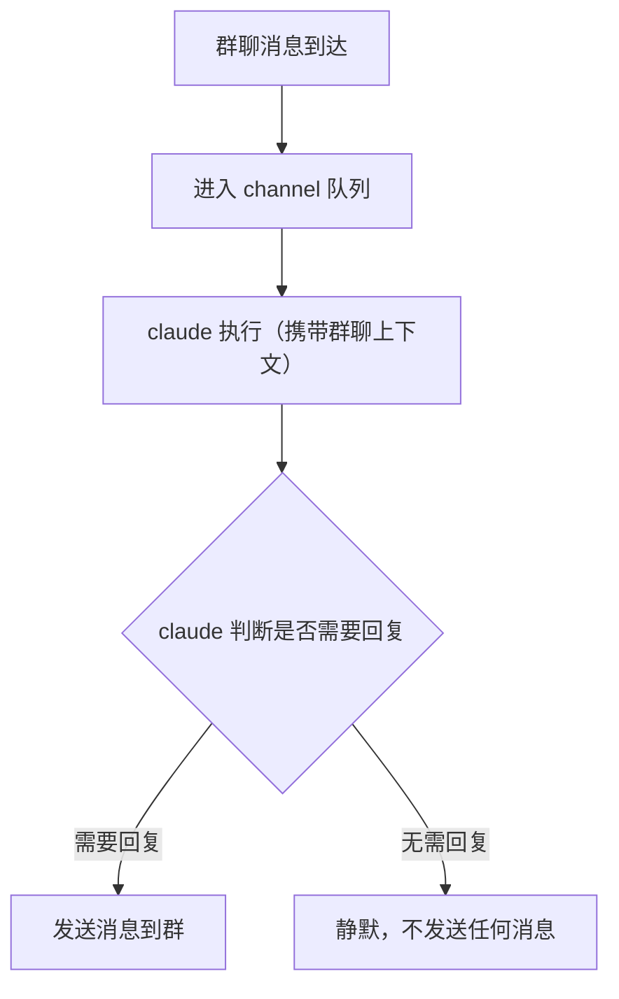

回复策略完全由 workspace 的 CLAUDE.md 定义，框架不做过滤。

---

### 5.4 普通消息完整流程

```mermaid
sequenceDiagram
    actor User as 用户
    participant FS as 飞书服务
    participant WS as WS Client
    participant Router as 消息路由器
    participant DB as SQLite
    participant Worker as Session Worker
    participant Exec as Claude Executor
    participant Claude as claude CLI

    User->>FS: 发送消息（可含图片/文件）
    FS->>WS: WS 推送 P2MessageReceiveV1
    WS->>Router: 解析事件，构造 channel_key
    Router->>FS: 下载附件（如有），保存到 os.TempDir()，写入 prompt 临时路径
    Router->>Worker: 入队（channel_key，携带含临时路径的 prompt）

    Worker->>Worker: moveAttachments() 将临时文件移入 sessions/<id>/attachments/
    Worker->>FS: 发送"思考中..."卡片
    Worker->>Exec: 执行（prompt, session_id, claude_session_id, channel_key, sender_id）

    Exec->>Exec: 创建 sessions/<session-id>/attachments/ 目录\n写入 SESSION_CONTEXT.md\ninjectRoutingContext() 将 routing_key+sender_id prepend 到 prompt

    Exec->>Claude: 子进程\n-p "<system_routing>...\n用户 prompt"\n--output-format stream-json\n--verbose\n--permission-mode acceptEdits\n--allowedTools ...\n--max-turns N\n--resume claude_session_id（如有）\n[cmd.Dir = session目录; WORKSPACE_DIR=... env]

    Claude-->>Exec: stream-json 输出（执行完成）
    Exec->>Exec: 从 system 事件提取 claude_session_id（首次时）
    Exec-->>Worker: ExecuteResult{Text, ClaudeSessionID, CostUSD, DurationMS}

    Worker->>DB: 写入 messages 记录（含 sender_id）& 更新 claude_session_id
    Worker->>FS: PATCH 卡片为最终结果
```

---

### 5.5 /new 命令流程

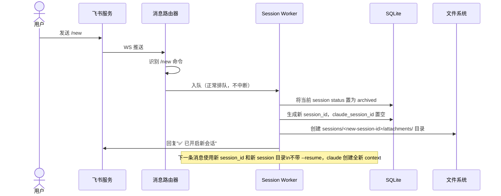

---

### 5.6 任务创建流程（skill 写文件）

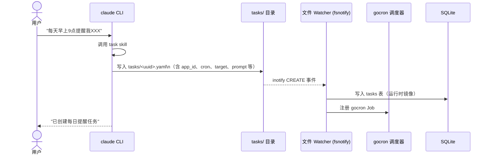

**任务文件格式**（`tasks/<uuid>.yaml`）：

```yaml
id: "550e8400-e29b-41d4-a716-446655440000"
app_id: "product-assistant"          # ← 必填，框架据此找 workspace
name: "每日技术早报"
cron: "0 9 * * 1-5"
target_type: "p2p"                   # p2p / group
target_id: "ou_xxx"                  # open_id 或 chat_id
prompt: "请生成今日技术早报"
created_by: "ou_xxx"
created_at: "2026-03-05T09:00:00Z"
enabled: true
```

- YAML 文件由 claude 按 task skill 规范写入，为 **source of truth**
- 删除文件 → 注销任务（watcher 监听 DELETE/RENAME 事件）
- 修改文件 → 更新任务（watcher 监听 WRITE 事件）
- 框架**启动时从 DB** 查询 `enabled=true` 的任务并恢复注册（watcher 负责 YAML→DB 同步，restoreEnabledTasks 从 DB 读取）

---

### 5.7 后台任务触发流程

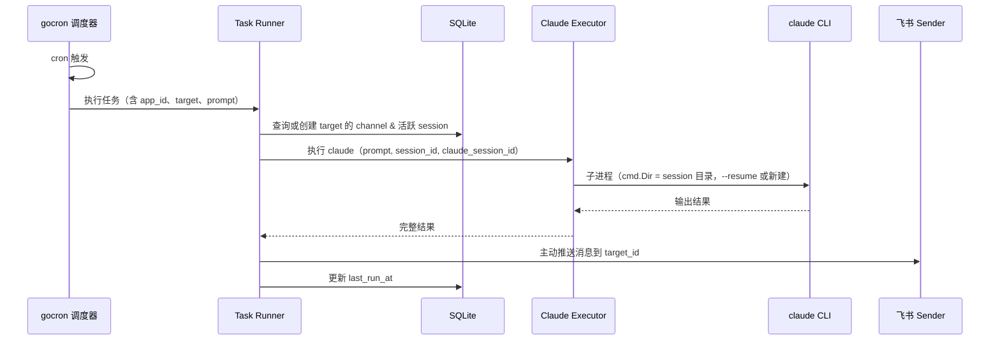

---

## 六、并发隔离

### 两层隔离方案

同一 app 下不同 session 并发执行时，通过两层隔离防止冲突：

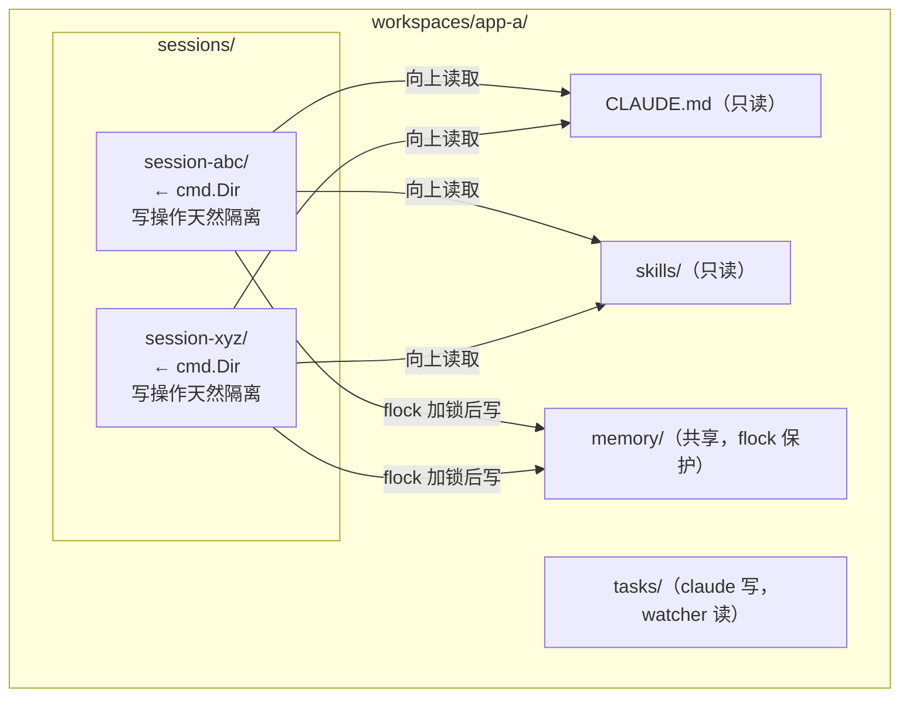

| 目录 | 访问模式 | 隔离方式 |
|---|---|---|
| `CLAUDE.md` / `skills/` | 只读 | 无需锁 |
| `memory/` | 多 session 共享写 | flock（每 app 一个 `.memory.lock`）|
| `tasks/` | claude 写，watcher 读 | 每任务独立文件名，无冲突 |
| `sessions/<id>/` | 单 session 独占写 | 目录级隔离，无需锁 |

### 绝对路径注入（SESSION_CONTEXT.md）

框架在启动每个 claude 进程前，写入 `SESSION_CONTEXT.md` 到 session 目录，提供所有绝对路径：

```markdown
# Session Context
- App ID: product-assistant
- Workspace: /data/workspaces/product-assistant
- Memory dir: /data/workspaces/product-assistant/memory
- Memory lock: /data/workspaces/product-assistant/.memory.lock
- Tasks dir: /data/workspaces/product-assistant/tasks
- Session ID: abc-123
- Session dir: /data/workspaces/product-assistant/sessions/abc-123
- Attachments dir: /data/workspaces/product-assistant/sessions/abc-123/attachments
```

skill 中所有路径均来自此文件，不使用任何相对路径。

### routing_key / sender_id 注入（prompt 前置）

`routing_key` 和 `sender_id` **不经过 SESSION_CONTEXT.md**，而是由 executor 在执行前直接 prepend 到 prompt：

```
<system_routing>
routing_key: p2p:oc_xxxx
sender_id: ou_yyyy
</system_routing>

用户实际 prompt 内容...
```

这样做的原因：SESSION_CONTEXT.md 由 executor 写入，若多个 goroutine 并发写同一文件会产生竞态；routing_key/sender_id 注入到 prompt 里则无此问题。

---

## 七、Workspace 目录结构

```
workspaces/<app-id>/
├── CLAUDE.md                  # app 级共享配置（claude 向上读取）
├── .memory.lock               # flock 锁文件（框架自动创建）
├── skills/
│   ├── feishu_ops/            # 飞书操作（初始化时由 workspace.Init 写入）
│   │   ├── SKILL.md           # 飞书 API 操作手册
│   │   ├── feishu.json        # 凭证（0o600，框架写入）
│   │   └── scripts/           # Python 脚本（18 个）
│   ├── memory.md              # 长记忆 skill（含 flock 写入指南）
│   ├── task.md                # 定时任务 skill（tasks/*.yaml 格式规范）
│   └── cases.md               # 事件记录 skill（cases/ 目录管理规范）
├── memory/                    # 长记忆（共享，flock 保护）
│   ├── MEMORY.md              # 主索引 + 初始化进度（模板初始化）
│   └── user_profile.md        # 用户档案（模板初始化）
├── cases/                     # 事件案例库（claude 按需创建）
│   ├── index.md
│   └── YYYY-MM-DD-{slug}.md
├── tasks/                     # 定时任务配置（claude 写，watcher 监听）
│   └── <uuid>.yaml
└── sessions/
    └── <session-id>/          # cmd.Dir 指向这里
        ├── SESSION_CONTEXT.md # 框架注入的绝对路径上下文
        └── attachments/       # 附件（定期清理）
```

**feishu.json 路径**：`skills/feishu_ops/feishu.json`（0o600 权限）。凭证由 `workspace.Init()` 写入，不暴露给 LLM，由 feishu_ops Python 脚本直接读取。

---

## 八、项目代码结构

```
cc-workspace-bot/
├── cmd/
│   └── server/main.go          # 入口：配置加载、组件连线、WS 客户端启动、优雅关闭
├── internal/
│   ├── config/
│   │   ├── config.go           # Viper YAML 配置结构 + Validate()
│   │   └── config_test.go
│   ├── model/
│   │   └── models.go           # GORM 数据模型（Channel / Session / Message / Task / TaskYAML）
│   ├── db/
│   │   └── db.go               # SQLite WAL 连接 + AutoMigrate
│   ├── feishu/
│   │   ├── receiver.go         # WS 事件解析、附件下载到 TempDir、Dispatcher 接口
│   │   └── sender.go           # SendThinking / UpdateCard / SendText
│   ├── session/
│   │   ├── manager.go          # channel_key → Worker 懒启动（sync.Map + WaitGroup）
│   │   └── worker.go           # 串行队列、/new、空闲超时、moveAttachments
│   ├── claude/
│   │   ├── executor.go         # 子进程调用、SESSION_CONTEXT.md 注入、routing 注入、stream-json 解析
│   │   └── executor_test.go    # channelKeyToRoutingKey / injectRoutingContext 单测
│   ├── workspace/
│   │   ├── init.go             # 目录初始化 + feishu.json 写入 + 模板复制（跳过 symlink）
│   │   └── init_test.go
│   └── task/
│       ├── watcher.go          # fsnotify 监听 tasks/ 目录变更
│       ├── scheduler.go        # gocron/v2 调度器管理
│       ├── scheduler_test.go
│       ├── runner.go           # 任务执行（YAML 加载 + cron 校验 + claude 调用）
│       ├── runner_test.go
│       ├── cleanup.go          # 附件清理（archived 超 retention_days 或超 max_days 强制）
│       └── cleanup_test.go
├── workspaces/
│   └── _template/              # 新 workspace 默认模板
│       ├── CLAUDE.md           # 含初始化模式、工作模式占位符、技能索引
│       ├── .claude/
│       │   └── settings.local.json  # 最小权限白名单（flock / feishu_ops 脚本 / 基础命令）
│       ├── memory/
│       │   ├── MEMORY.md       # 主索引 + 初始化进度清单
│       │   └── user_profile.md # 用户档案模板
│       └── skills/
│           ├── memory.md       # 含 flock 写入指南和绝对路径用法
│           ├── task.md         # tasks/*.yaml 格式规范
│           ├── cases.md        # 事件记录规范（cases/ 目录）
│           └── feishu_ops/     # 飞书集成（scripts/ + SKILL.md）
├── config.yaml.template        # 配置示例
├── go.mod / go.sum
└── bot.db                      # SQLite 数据库（运行时生成）
```

---

## 九、应用配置（config.yaml）

```yaml
apps:
  - id: "product-assistant"
    feishu_app_id: "cli_xxx"
    feishu_app_secret: "xxx"
    feishu_verification_token: "xxx"
    feishu_encrypt_key: ""
    workspace_dir: "/data/workspaces/product-assistant"
    allowed_chats: []                  # 空表示不限制
    claude:
      permission_mode: "acceptEdits"   # acceptEdits / bypassPermissions
      allowed_tools:                   # 空表示不限制
        - "Bash"
        - "Read"
        - "Edit"
        - "Write"

  - id: "code-review"
    feishu_app_id: "cli_yyy"
    feishu_app_secret: "yyy"
    workspace_dir: "/data/workspaces/code-review"
    allowed_chats:
      - "oc_abc123"
    claude:
      permission_mode: "acceptEdits"
      allowed_tools:
        - "Read"
        - "Bash"

server:
  port: 8080

claude:
  timeout_minutes: 5
  max_turns: 20

session:
  worker_idle_timeout_minutes: 30    # Worker 空闲超时，触发 session 归档

cleanup:
  attachments_retention_days: 7     # session 归档后附件保留天数
  attachments_max_days: 30          # 强制清理天数上限
  schedule: "0 2 * * *"             # 每天凌晨 2 点执行
```

---

## 十、附件清理机制

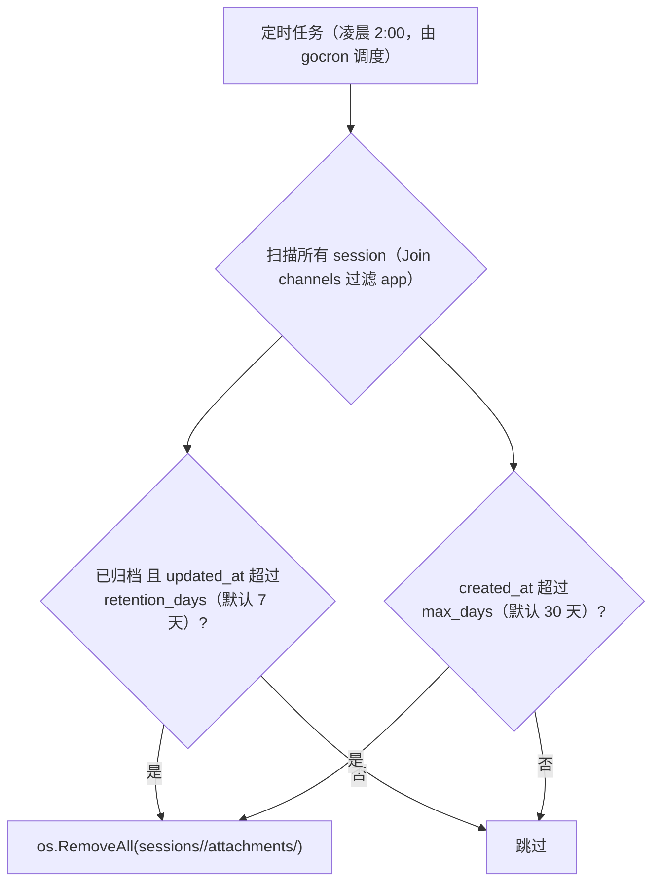

清理范围：仅删除 `attachments/` 子目录；`SESSION_CONTEXT.md` 及 session 目录本身保留；SQLite 中的 session / message 记录永久保留。

---

## 十一、全部设计决策汇总

| 决策点 | 结论 | 实现位置 |
|---|---|---|
| CLAUDE.md 向上查找 | 利用，不隔断；父目录可放全局配置 | `cmd.Dir = sessions/<id>/`，自然继承 workspace |
| 并发隔离 | `cmd.Dir` 指向 session 目录；memory/ 用 flock 加锁 | `claude/executor.go`，skill 层 flock |
| 绝对路径 | 框架注入 SESSION_CONTEXT.md，skill 全用绝对路径 | `executor.go:writeSessionContext` |
| routing_key 注入 | prepend 到 prompt（避免 SESSION_CONTEXT.md 并发写竞态） | `executor.go:injectRoutingContext` |
| channel_key 格式 | P2P 用 chat_id 不是 open_id；thread 映射到 group | `feishu/receiver.go:buildChannelKey` |
| routing_key 转换 | 内部 channel_key → feishu_ops routing_key（去 app_id 后缀） | `claude/executor.go:channelKeyToRoutingKey` |
| Context 管理 | `--resume` 复用 claude session；`/new` 时不传 --resume | `session/worker.go:getOrCreateSession` |
| 群聊触发 | 所有消息触发，claude 自行判断是否回复 | `receiver.go`（无过滤），workspace CLAUDE.md 定义策略 |
| 附件处理 | 下载到 os.TempDir() → worker moveAttachments 移入 session/attachments/ | `receiver.go:downloadImageResource/downloadFile` + `worker.go:moveAttachments` |
| 附件 prompt 格式 | `[图片: /abs/path]` 和 `[文件: /abs/path]` | `receiver.go:parseContent` + `worker.go:replacePaths` |
| 结果展示 | 仅展示最终结果，一次性 PATCH 卡片 | `sender.go:UpdateCard` |
| 任务创建 | claude 通过 task skill 直接写 tasks/*.yaml，框架 watch 注册 | `task/watcher.go` + `task/scheduler.go` |
| 任务恢复 | 启动时从 DB 查 enabled 任务（watcher 保证 YAML→DB 同步） | `cmd/server/main.go:restoreEnabledTasks` |
| 并发写锁 | memory/ 用 flock；task 文件独立文件名无冲突 | skill 层实现，框架不干预 |
| 附件清理 | 两级清理：归档后 7 天 + 最大 30 天强制；gocron 定时执行 | `task/cleanup.go:Cleaner` |
| Worker 超时 | 空闲 30 分钟自动退出，触发 session 归档 | `session/worker.go:run` idleTimeout |
| 数据持久化 | SQLite WAL；task YAML 文件为 source of truth，DB 为运行时镜像 | `db/db.go`，`glebarez/sqlite` |
| 初始化循环依赖 | `dispatchForwarder` + `atomic.Pointer` | `cmd/server/main.go` |
| 优雅关闭 | `sessionMgr.Wait()` 等待所有 worker；HTTP Shutdown(10s) | `session/manager.go:Wait()` |
| HTTP 安全 | ReadHeaderTimeout=5s / ReadTimeout=10s / WriteTimeout=10s / IdleTimeout=60s | `cmd/server/main.go:httpServer` |
| HTTP 健康检查 | `GET /health` → 200 OK | `cmd/server/main.go` |
| 附件大小限制 | 100 MiB per file（`io.LimitReader`）| `feishu/receiver.go:saveBody` |
| stdout 缓冲 | 1 MiB per-line buffer（避免大输出截断）| `claude/executor.go:scannerMaxBytes` |
| 进程组管理 | `Setpgid: true` + `WaitDelay=30s`（保证子进程树完整退出）| `claude/executor.go:Execute` |
| Cron 校验 | `LoadYAML` 时用 `robfig/cron/v3` 校验表达式 | `task/runner.go:LoadYAML` |
| feishu.json 路径 | `skills/feishu_ops/feishu.json`（0o600）；Init 时写入 | `workspace/init.go:writeFeishuConfig` |
| Workspace 初始化模式 | CLAUDE.md 内置引导流程，memory/MEMORY.md 有进度清单 | `workspaces/_template/` |
| WORKSPACE_DIR 环境变量 | subprocess 注入 `WORKSPACE_DIR=req.WorkspaceDir` | `claude/executor.go:Execute` |
